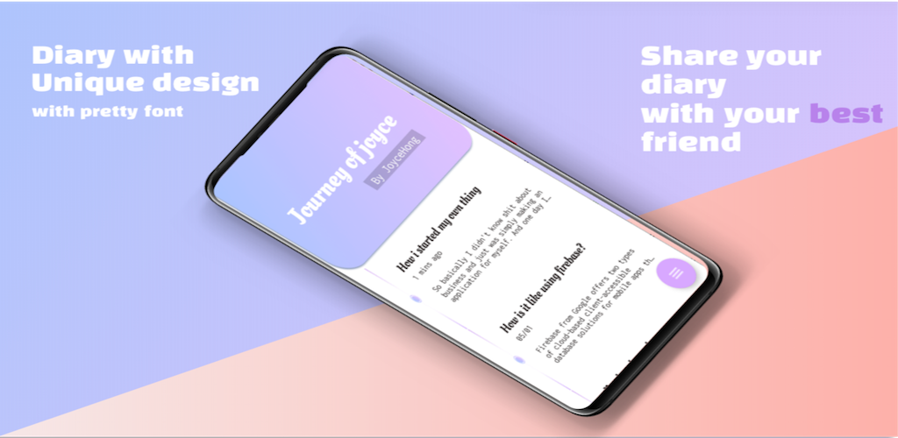
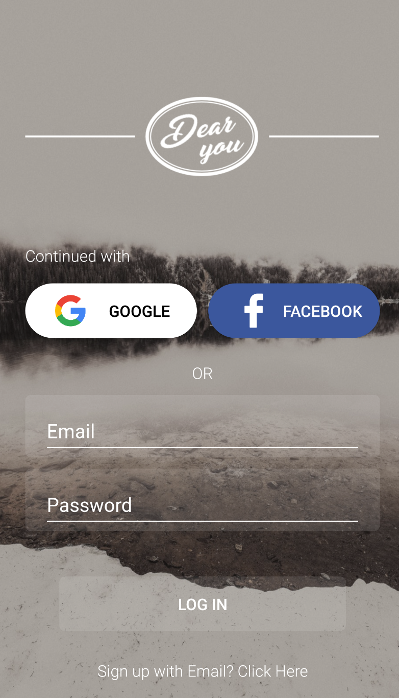
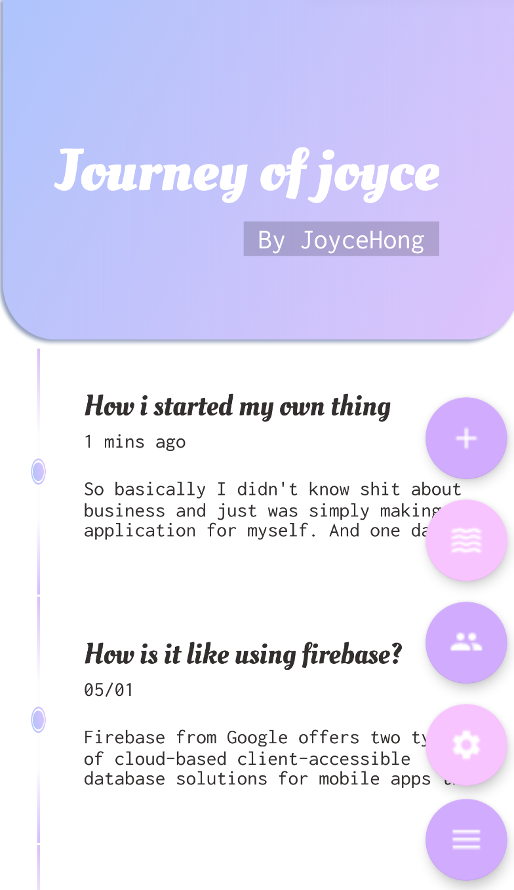

# Currently this application has been deleted from Google Play due to fundamental server change!

# DearYou - Social diary app with extraordinary design

 
 

 
 
DearYou is a diary app with the most unique and adorable design that you can find in Google Play. Add your close friends and share your day with them. DearYou has a locker where you can share what you want to share. 
  
 

- Used firebase authentication for social login(Google,Facebook) and email sign up
- Used firestore for saving diary data
  
 
  
 
 
Login page. User can sign up with their social account or email.
  
 

  
 
Main page. 
It shows list of user's diaries. You can see a preview of diary and when it was written as well.
In the speed dial menu, there are setting button, friend search button, and random diary(not featured yet) button.
